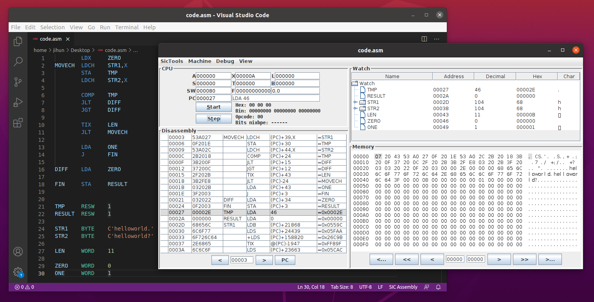
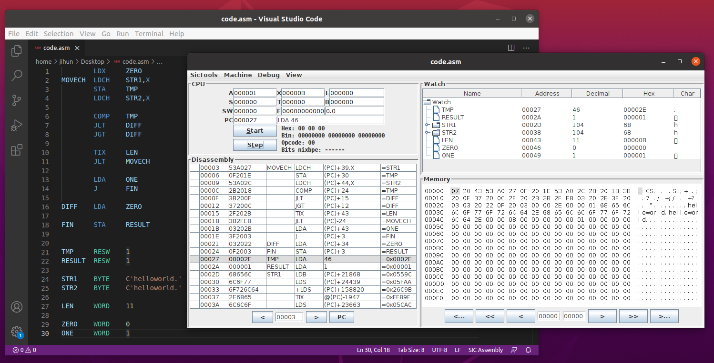

## String Compare

### 프로그램 설명

- 메모리에 선언된 두 Byte 배열(String), STR1 과 STR2 이 같은 배열인지 검사한다.
- 두 문자열이 같다면 RESULT에 1이 저장되고 그렇지 않다면 0이 저장된다.

### 코드 설명

- X 레지스터는 비교할 문자열의 인덱스를 나타내기 위해 사용된다. 실질적으로는, 문자열의 시작 주소에서 +X 만큼 더해가며 문자열의 메모리에 접근한다. X 레지스터에 값을 더해가는 과정에는 TIX instruction이 사용된다.
- A 레지스터는 반복문을 돌면서 메모리로부터 가져온 문자 한 개를 저장할 용도로 사용된다. 특히, 레지스터가 24bit이고, 아스키코드는 8bit로 표현되기 때문에, 문자의 내용을 안전하게 저장하기 위해 메모리로부터 가져올 때에는 LDCH instruction(8bit만 메모리로부터 가져옴) 으로, 메모리에 저장할 때에는 STA instruction(24bit를 메모리에 저장함)을 사용했다.
- 레지스터가 24bit이기 때문에, string(문자 배열)을 표현할 때 외에는 모두 WORD 또는 RESW를 사용한다.

### 알고리즘 설명

- STR1으로부터 A 레지스터에 문자 하나를 가져온다. 가져온 문자는 임시저장을 위해 TMP변수에 저장한다.
- STR2로부터 A 레지스터에 문자 하나를 가져온다.
- TMP에는 STR1에 대한 문자가, A 레지스터에는 STR2에 대한 문자가 있을 것이므로 COMP instruction을 사용해서 TMP와 A 레지스터의 문자 값을 비교한다.
- 만약 문자가 서로 다르다면 RESULT변수에는 0을 저장하고 프로그램을 끝낸다.
- 문자가 같다면, 다시 1)로 올라가 문자열의 길이만큼 반복한다.
- 문자열의 길이만큼 X 레지스터에 값이 더해졌다면, 두 문자열은 같은 내용의 문자열이다. 따라서 RESULT변수에 1을 저장하고 프로그램을 끝낸다.

### 시연결과

#### 서로 다른 문자열 비교

#### 서로 같은 문자열 비교

